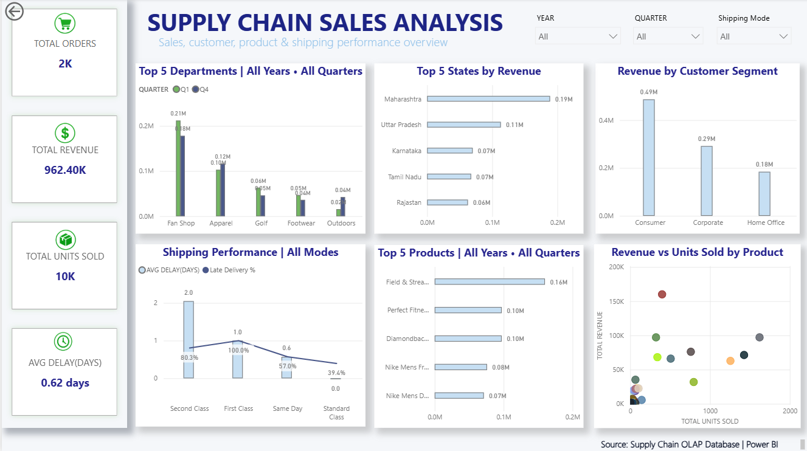

# supply-chain-sales-analytics
An end-to-end sales analytics project transforming OLTP data into an OLAP star schema and developing an interactive Power BI dashboard for revenue, product, customer, geographical and shipping analysis.
# Supply Chain Sales Analytics

## 📊 Project Overview

This project analyzes supply chain sales data to identify key business trends across revenue, customers, products, geography, and shipping performance.

The project follows an end-to-end analytics workflow:

- SQL-based data transformation and analysis
- OLTP to OLAP data warehouse modeling
- Data cleaning and preparation
- Power BI data modeling
- DAX measures and calculated metrics
- Interactive dashboard development
- Business insight generation

---

## 🎯 Business Objectives

The analysis focuses on answering key business questions:

- Which departments generate the highest revenue?
- Which states contribute the most revenue?
- Which customer segments generate the most sales?
- Which products are the top revenue contributors?
- How does shipping mode affect delivery performance?
- Is there a relationship between units sold and revenue?
- How does revenue vary across available quarters and years?

---

## 🗂️ Project Structure

```text
Supply-Chain-Sales-Analytics/
│
├── Dashboard/
│   └── Power BI dashboard screenshots
│
├── Documentation/
│   └── Project documentation
│
├── PowerBI/
│   └── Power BI project files
│
├── SQL/
│   ├── OLTP_to_OLAP.sql
│   └── analysis_queries.sql
│
└── README.md

🛠️ Tools & Technologies
Tool	Purpose
MySQL	Data transformation and analysis
SQL	Data extraction, aggregation and analytical queries
Power BI	Interactive dashboard and visualization
DAX	Measures and calculated metrics
Power Query	Data preparation and transformation
GitHub	Project version control and documentation
🏗️ Data Architecture

The project transforms transactional supply chain data into an analytical OLAP structure.

OLTP → OLAP

The analytical model contains:

Fact table for order sales
Date dimension
Customer dimension
Product dimension
Geography dimension
Shipping dimension

This structure supports efficient analytical queries and Power BI reporting.

📈 Power BI Dashboard



The dashboard provides an overview of:

Key Performance Indicators
Total Orders
Total Revenue
Total Units Sold
Average Shipping Delay
Revenue Analysis
Revenue by Top 5 Departments
Top 5 States by Revenue
Revenue by Customer Segment
Top 5 Products by Revenue
Shipping Analysis
Average Shipping Delay by Shipping Mode
Late Delivery Percentage by Shipping Mode
Product Analysis
Revenue vs Units Sold by Product
Interactive Filters

The dashboard includes filters for:

Year
Quarter
Shipping Mode

Dynamic titles are also used to reflect the selected filter context.

🔍 Key Insights

The dashboard helps identify:

The highest revenue-generating departments
The strongest-performing states
Revenue contribution by customer segment
Top-performing products
Shipping modes with higher average delays
Relationship between product volume and revenue
📁 SQL Analysis

The SQL folder contains:

OLTP_to_OLAP.sql

Contains SQL transformations used to create the analytical data warehouse structure from transactional data.

analysis_queries.sql

Contains analytical SQL queries used to investigate sales, revenue, products, departments, shipping performance, and other business metrics.

🚀 Project Outcome

This project demonstrates an end-to-end data analytics workflow, from relational data transformation and SQL analysis to data modeling, DAX calculations, and interactive Power BI dashboard development.

👩‍💻 Author

Pranamya K.L.

Computer Science Engineering

Data Analytics | SQL | Power BI | Excel | Python
